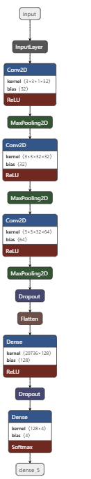

# Driver-Drowsiness-Detection

## Applications 🎯
This can be used by riders who tend to drive for a longer period of time that may lead to accidents

### Description 📌
A computer vision system that can automatically detect driver drowsiness in a real-time video stream and then play an alarm if the driver appears to be drowsy

### Dependencies
1) import cv2
2) import tensorflow
3) import keras
4) import numpy

# Drowsiness Detection WebAPP


# MODEL ARCHITECTURE



### Execution 🐉
To run the code, type `python app.py`

```
python app.py
```

